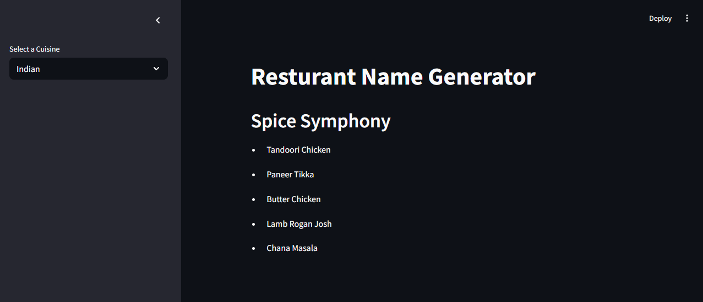

# Restaurant Name Generator

## Description
This project is a Streamlit web application that generates creative restaurant names and popular menu items based on a selected cuisine. It leverages the power of OpenAI's GPT-4o-mini model through LangChain to generate unique and relevant restaurant names and menu suggestions.

## Features
- Select from multiple cuisines including Indian, Italian, Chinese, Mexican, and American.
- Generate a creative restaurant name tailored to the selected cuisine.
- Generate a list of five popular menu items for the generated restaurant.
- Interactive and user-friendly web interface using Streamlit.

## Installation

1. Clone the repository or download the project files.
2. Create and activate a virtual environment:

```bash
python -m venv venv
# On Windows
venv\Scripts\activate
# On Unix or MacOS
source venv/bin/activate
```

3. Install the required dependencies using pip:

```bash
pip install -r requirements.txt
```

4. Set up your OpenAI API key:
   - Create a file named `secret.py` in the project root.
   - Add the following line with your actual OpenAI API key:

```python
OPENAI_API_KEY = "your_openai_api_key_here"
```

## Usage

Run the Streamlit app with the following command:

```bash
streamlit run main.py
```

This will open a web interface where you can select a cuisine from the sidebar and get a generated restaurant name along with menu items.

## Project Structure

- `main.py`: The main Streamlit application file that handles the user interface and interaction.
- `langchain_helper.py`: Contains the logic for generating restaurant names and menu items using LangChain and OpenAI.
- `secret.py`: Stores your OpenAI API key (not included in the repository for security reasons).
- `requirements.txt`: Lists all Python dependencies required for the project.

## API Key Setup

This project requires an OpenAI API key to access the GPT model. Make sure to obtain your API key from [OpenAI](https://platform.openai.com/account/api-keys) and add it to the `secret.py` file as described above.

## License

This project is open source and available under the MIT License.

## Screenshot



